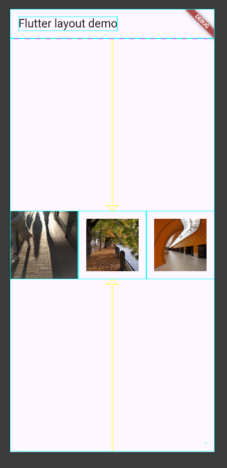
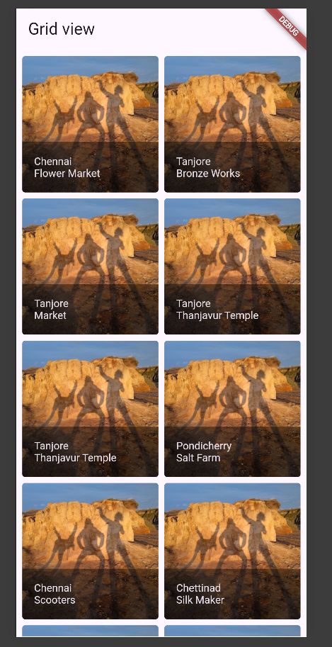

Nama    : Erlang Sinatrya Putra Yusya

NIM     : 362358302083

Kelas   : 2B TRPL

        Material Apps

code : [scaffold](lib/widged/scaffold_widget.dart)

code main : 

hasil :

        Cupertino Apps

code : [cupertino](lib/widged/cupertino.dart)

hasil :

        Non-Material apps

Code : [stateless](lib/widged/stateless_widget.dart)

hasil :

        Aligning widgets

code : [row](lib/widged/row.dart)

hasil : 

    Sizing widgets

code : [sizingwidgets](lib/widged/sizing_widget.dart)

hasil :

        Packing Widget

code : [text](lib/widged/packing_widget.dart)

hasil :

        Nesting rows and columns

code : [text](lib/widged/nesting_row.dart)

hasil :

        Examples (GridView)

code : [text](lib/widged/example_grid.dart)

hasil : 

        Example (Grid Title)

code : [text](lib/widged/grid_title.dart)

hasil :

        Colors Demo

code : [text](lib/widged/colors_demo.dart)

hasil :

        Examples Card

code : [text](lib/widged/card.dart)

hasil : 

        Cards Demo

code : [text](lib/widged/cards_demo.dart)

hasil :

        List Demo

code : [text](lib/widged/list_demo.dart)

hasil : 

        Profil card

code : [text](lib/widged/profil_card.dart)

hasil :

